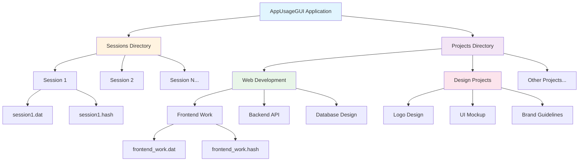

# AppUsageGUI
### Application Runtime Tracker

This program tracks the runtime of specified applications, organizing sessions into projects. Users can create multiple projects, each containing multiple tracking sessions, providing comprehensive time tracking and data analysis.

## Installation

To install, follow the instructions for your platform found here:

[Windows](docs/install_windows.md) | [macOS](docs/install_macos.md)

## Contributing

### Contributions are welcome and needed! Here is a TODO list:

* Add integrations with professional applications
* Detach the GIL for windows version
* Add a better way to filter out non-GUI apps on macOS
* Full linux support with packages

NOTE: GIL is detached for the macOS build; use Python 3.13.7t

## How It Works

AppUsageGUI is a cross-platform desktop application built with Python and Tkinter that monitors application usage time with project-based organization. The application works by:

1. **Project Organization**: Users create projects to organize related tracking sessions, with each project containing multiple sessions
2. **Session Creation**: Before tracking begins, users select a project and name their session
3. **Process Monitoring**: Uses the `psutil` library to detect running applications and monitor their process status
4. **Time Tracking**: Implements a precise time tracker that runs in a separate thread, capable of pausing and resuming
5. **Session Management**: Creates named sessions within projects that can be saved, loaded, and continued across application restarts
6. **Data Persistence**: Saves session data with integrity checking using hash verification, organized by project directories
7. **Cross-Platform Support**: Handles Windows and macOS differences in process detection and GUI application filtering

The application follows a Model-View-Controller (MVC) architecture with separate logic and GUI components.

## Project and Session Structure

AppUsageGUI organizes your time tracking data using a hierarchical project-based structure. This allows you to group related sessions together and manage your time tracking more effectively.

### Data Organization

```
AppUsageGUI/
├── Sessions/                          # Standalone sessions (No Project)
│   ├── session1.dat
│   ├── session1.hash
│   ├── session2.dat
│   └── session2.hash
├── Projects/                          # Project-organized sessions
│   ├── Web Development/               # Custom project
│   │   ├── frontend_work.dat
│   │   ├── frontend_work.hash
│   │   ├── backend_api.dat
│   │   └── backend_api.hash
│   ├── Design Projects/               # Another custom project
│   │   ├── logo_design.dat
│   │   ├── logo_design.hash
│   │   └── ui_mockup.dat
│   └── projects_metadata.json         # Project information and metadata
└── User/
    ├── config.dat                     # User configuration
    └── apps.dat                       # Tracked applications list
```

### Project Structure Diagram



### Key Concepts

- **Projects**: Top-level containers that group related sessions together, stored in the `Projects/` directory
- **Standalone Sessions**: Sessions not assigned to any project, stored directly in the `Sessions/` directory
- **"No Project"**: A UI label for sessions that aren't assigned to any project (not an actual project directory)
- **Sessions**: Individual time tracking instances that can belong to a project or exist standalone
- **Session Files**: Each session consists of a `.dat` file (data) and `.hash` file (integrity check)
- **Metadata**: Project information is stored in `projects_metadata.json` including creation dates and session counts

### Session Data Structure

Each session file contains comprehensive tracking information:

```python
{
    'app_name': 'Visual Studio Code',           # Application being tracked
    'time_spent': 7200.5,                      # Total time in seconds
    'session_version': '2.0.0',                # App version when created
    'config': {...},                           # Tracking configuration
    'time_captures': [...],                    # Detailed time capture data
    'project_name': 'Web Development',         # Project this session belongs to
    'created_date': '2024-01-15T10:30:00',    # When session was created
    'last_modified': '2024-01-15T12:30:00'    # Last modification time
}
```

## Features

- **Project Management**: Organize sessions into projects for organization and management
- **Session Tracking**: Track the total runtime of any executable with named sessions
- **Session Continuation**: Continue from previous sessions within any project
- **User Customizable Rules**: Configure custom tracking rules and application filtering
- **Cross-Platform Support**: Works on Windows and macOS (macOS installation requires permissions)
- **Data Integrity**: Session data integrity with hash verification
- **Pause/Resume**: Pause and resume functionality during active tracking
- **Smart Detection**: Automatic detection of GUI applications vs background processes
- **Project Analytics**: View total time spent across all sessions within a project
- **Migration Support**: Automatic migration of existing sessions to the new project structure

## User Workflow

### New Session Creation
The application now uses a streamlined workflow where users select their project and session name before starting the timer:

1. **Main Menu** → "Start new session"
2. **Create Session Window** → Select project and enter session name
3. **Select App Window** → Choose application to track
4. **Tracker Window** → Timer runs with pause/resume controls
5. **Save Window** → Save session data
6. **Session Total Window** → View results and statistics

### Project Management
- **Main Menu** → "Manage Projects" → View all projects with session counts and total time
- **Create New Project** → Set up new project containers
- **View Project Sessions** → Manage sessions within specific projects
- **Delete Projects** → Remove projects and all associated sessions (with confirmation)

### Continuing Existing Sessions
- **Main Menu** → "Continue previous session" → Navigate through projects to find and resume sessions
- Sessions can be continued across application restarts with full state preservation

## Code Structure

### Core Application Files

- **`src/main.py`** - Application entry point that initializes the Tkinter root window, applies dark mode theming, sets up the application icon, and launches the splash screen
- **`src/_version.py`** - Contains the application version number
- **`src/_path.py`** - Handles resource path resolution for bundled applications

### Core Logic (`src/core/`)

#### Main Controllers
- **`gui_root.py`** - Main GUI controller that manages the application's window system, initializes all screens, and handles navigation between different windows
- **`logic_root.py`** - Central logic controller that coordinates all tracking components (AppTracker, TimeTracker, FileHandler, ProjectHandler, MouseTracker)

#### Logic Components (`src/core/logic/`)
- **`app_tracker.py`** - Monitors running processes using psutil, filters GUI applications from background processes, and maintains lists of available applications for tracking
- **`time_tracker.py`** - Implements precise time tracking with pause/resume functionality, runs in a separate thread for accuracy, and captures timing data for analysis
- **`file_handler.py`** - Manages session data persistence, handles file I/O operations with pickle serialization, and implements data integrity checking using hash verification
- **`project_handler.py`** - Manages project creation, deletion, and organization, handles project metadata and session counts
- **`user_trackers.py`** - Contains additional tracking modules like MouseTracker for user activity monitoring and ResolveProjectTracker for specific application integration

#### User Interface (`src/core/screens/`)
- **`main_window.py`** - Main menu screen providing options to start new sessions, manage projects, continue previous sessions, or configure settings
- **`projects_window.py`** - Project management interface for viewing, creating, and deleting projects with session counts and total time
- **`create_project_window.py`** - Project creation dialog with name validation and project setup
- **`project_sessions_window.py`** - Project-specific session management interface for viewing and managing sessions within a project
- **`create_session_window.py`** - Session creation dialog with project selection, name validation, and session setup
- **`select_app_window.py`** - Application selection interface with search functionality and real-time app list updates
- **`tracker_window.py`** - Active tracking display showing elapsed time, pause/resume controls, and stop functionality
- **`sessions_window.py`** - Global session management interface for loading, analyzing, and deleting saved sessions across all projects
- **`save_window.py`** - Session saving interface with data confirmation
- **`session_total_window.py`** - Session summary display showing total tracked time and statistics
- **`tracker_settings_window.py`** - Configuration interface for custom tracking rules and application filtering
- **`splash_screen.py`** - Application startup splash screen with loading animation

#### Utilities (`src/core/utils/`)
- **`file_utils.py`** - File system operations, directory management, session file handling, project directory management, and data integrity functions
- **`time_utils.py`** - Time formatting utilities for displaying elapsed time in human-readable format
- **`logic_utils.py`** - Threading utilities and decorators for running functions in separate threads
- **`tk_utils.py`** - Tkinter-specific utilities including window centering and dark mode detection

### Resources (`src/core/resources/`)
- **`icon.ico`** / **`icon.icns`** - Application icons for Windows and macOS respectively
- **`icon-resources/`** - Source files for application icons

### Development and Build Files
- **`setup.py`** - Python package configuration and installation setup
- **`build.py`** - Build script for creating distributable packages
- **`requirements.txt`** - Python dependencies list
- **`pytest.ini`** - Testing configuration
- **`tests/`** - Unit tests for application components including project management and session creation workflows


